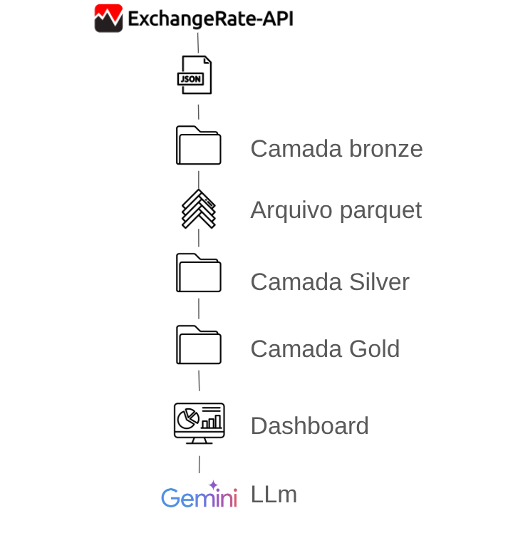

Descrição:

Este repositório contém um notebook em Python desenvolvido para realizar requisições de uma API com cotações de moedas do mundo comparadas com o dólar e tem como objetivo responder à uma atividade academica.

Funcionalidades:

Conexão e autenticação com a API exchangerate https://www.exchangerate-api.com/.

Na camada /bronze salvamos os arquivos jsons com os resultados row.
Na camada /silver salvamos os arquivos .parquet com os tratamentos dos dados.
Na camada /gold salvamos os arquivos .parquet com os resultados filtrados somente com as cotações das moedas da América do sul para analise.

Após tratar e particionar os dados realizamos uma analise, via gráfico, com o plotly para analisar as variações de cada moeda sul americana com o dólar.

#fluxo do projeto: 

Integração com a biblioteca Google Generative AI(Gemini).

Envio de requisições HTTP parametrizadas.

Organização e análise de resultados em ambiente Jupyter Notebook.

Estrutura do Repositório:

request-api.ipynb   # Notebook principal com o script
requirements.txt    # Dependências do projeto (opcional)
README.md           # Documentação do projeto

Pré-requisitos: 

Python 3.9 ou superior.

Ambiente Jupyter Notebook.

Bibliotecas listadas em requirements.txt (requests, pandas, google-generativeai, os, plotly
pyarrow, fastparquet).

Instalação:

Clonar o repositório e instalar as dependências necessárias:

git clone git@github.com:adnnskt/exchange-rateAPI.git
cd exchange-rateAPI
pip install -r requirements.txt

Utilização:

Abrir o notebook no Jupyter:

jupyter notebook request-api.ipynb

Configurar as variáveis de ambiente com as chaves de API correspondentes, via arquivo .env (Google Generative AI e exchangerate):

Executar as células para envio das requisições e análise das respostas.

Exemplos de Saída:

Respostas textuais retornadas pelo modelo de linguagem.

Estruturação dos resultados em tabelas para análise comparativa.

Logs de execução para acompanhamento de testes.

Próximos Passos:

Expansão do suporte para múltiplos provedores de LLM.

Implementação de testes unitários e automatizados.

Integração com pipelines de dados e orquestradores, como Airflow e AWS Lambda.

Contribuição:

Contribuições são bem-vindas. Para alterações significativas, recomenda-se a abertura de uma issue para discussão prévia antes da submissão de um pull request.
